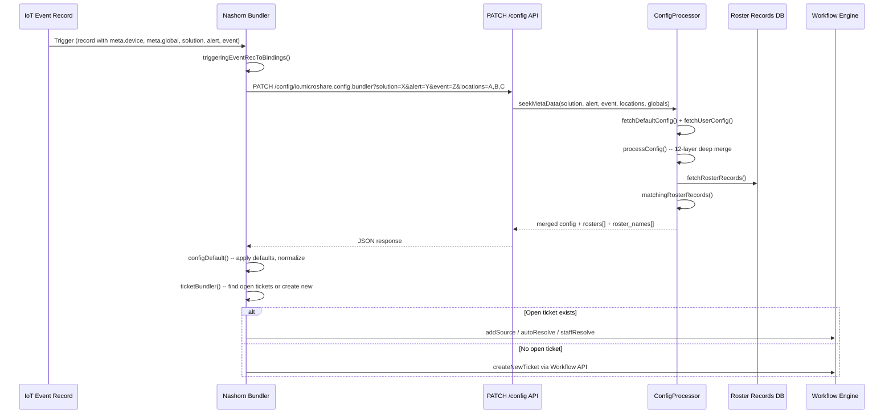
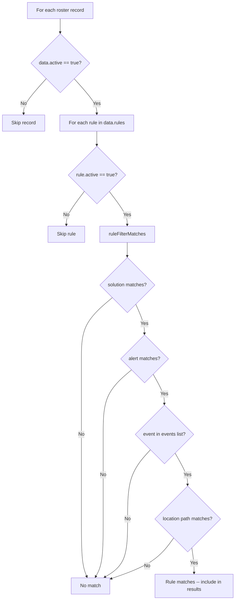
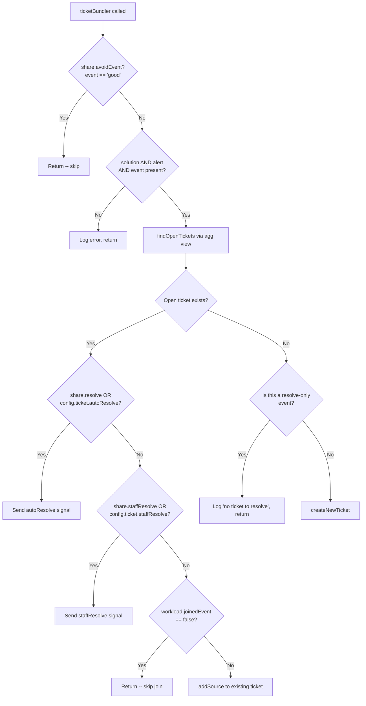

# Microshare Bundling System

> **Bundler version:** 2.2.0 | **Config format version:** 2.0.0

The Bundling System converts IoT sensor events into actionable workflow tickets. When an
event fires (e.g. a restroom soap dispenser reaches 80% empty), the bundler resolves a
hierarchical configuration, determines whether to create a new ticket or append to an
existing one, and routes the ticket to the correct work crew via roster matching.

---

## Table of Contents

1. [Architecture Overview](#1-architecture-overview)
2. [Configuration Specification](#2-configuration-specification)
   - [Bundler Config Record Structure](#21-bundler-config-record-structure)
   - [The 12-Layer Deep Merge](#22-the-12-layer-deep-merge)
   - [Client-Side Defaults](#23-client-side-defaults-configdefault)
   - [Ticket Config Fields](#24-ticket-config-fields)
3. [Roster (Route) Assignment](#3-roster-route-assignment)
   - [Roster Record Structure](#31-roster-record-structure)
   - [Matching Algorithm](#32-matching-algorithm)
   - [How Rosters Flow to Tickets](#33-how-rosters-flow-to-tickets)
4. [Bundler Decision Logic](#4-bundler-decision-logic)
5. [How-To Guide](#5-how-to-guide)
   - [Creating a New Bundler Config](#51-creating-a-new-bundler-config)
   - [Creating Roster Records](#52-creating-roster-records)
   - [Testing and Debugging](#53-testing-and-debugging)
   - [Zurich Airport Reference](#54-zurich-airport-fzag-reference)

---

## 1. Architecture Overview

### System Components

| Component | Technology | Location | Role |
|-----------|-----------|----------|------|
| **Nashorn Bundler** | JavaScript (Nashorn engine) | `scripts/libs/products/bundler.js` | Client-side orchestrator on the stream server. Receives IoT events, fetches config, decides ticket action. |
| **ConfigResource** | Scala (Pekko HTTP) | `microshare-service/.../resources/ConfigResource.scala` | HTTP route exposing `PATCH /config/{recType}` for config evaluation. |
| **ConfigProcessor** | Scala | `microshare-service/.../resources/ConfigProcessor.scala` | Server-side engine that resolves hierarchical configs and matches rosters. |
| **Workflow Engine** | Internal service | Accessed via `Workflow` API | Creates, updates, and resolves workflow tickets/incidents. |

### End-to-End Flow



### Execution Context

The bundler runs inside the **Nashorn** JavaScript engine on the stream server. The
`bindings` object is the only state maintained between executions (process cache). Its
main keys are:

| Key | Purpose |
|-----|---------|
| `bindings.auth` | Bearer token for API calls |
| `bindings.share` | Extracted data from the triggering event record |
| `bindings.config` | Merged and defaulted configuration from the PATCH response |
| `bindings.ticket` | Ticket payload assembled for the workflow engine |
| `bindings.workflow` | Workflow routing info (processType, processTypeId, useDefault) |
| `bindings.descriptor` | Robot descriptor with owner, host, and id |
| `bindings.wf_tasks` | Parsed task checklist items for the ticket |

### Entry Point

`action(text, configObj)` in `bundler.js` is the single exported function. It:

1. Validates `bindings.auth` is present
2. Initializes workflow bindings from `configObj`
3. Parses the incoming event record
4. Validates that both `meta.device` and `meta.global` tag arrays are non-empty
5. Extracts event data into `bindings.share`
6. Calls `configProcessor()` to fetch merged config via PATCH
7. Applies client-side defaults via `configDefault()`
8. Runs `ticketBundler()` to take action

---

## 2. Configuration Specification

### 2.1 Bundler Config Record Structure

A bundler config record is stored at recType `io.microshare.config.bundler`. The `data`
field of the record has the following hierarchical structure:

```
data
├── version                          # Config format version (e.g. "2.0.0")
├── config                           # Base defaults -- apply to ALL events
│   └── incident / ticket
│       ├── threshold: {low, medium, high}
│       ├── priority
│       ├── timing: {globalReminderTime, globalTimeoutTime}
│       ├── workload: {deviceTag}
│       ├── escalation: {priority, time, active}
│       ├── avoidEvent, autoResolve, staffResolve
│       ├── tasks: [...]
│       ├── labels: {initialTask, complementaryTask}
│       └── extra: {key: "template string"}
├── solutions
│   └── {solution-name}              # e.g. "clean"
│       ├── config                   # Solution-level defaults
│       │   └── incident / ticket
│       │       └── (same fields as above)
│       └── alerts
│           └── {alert-name}         # e.g. "feedback", "trash", "soap"
│               ├── config           # Alert-level defaults
│               └── events
│                   └── {event-name} # e.g. "soap", "fill_50", "active"
│                       └── config   # Event-level overrides
│                           └── incident / ticket
│                               └── (same fields)
└── locations[]                      # Array of location-specific overrides
    └── {                            # Each entry:
          device: ["A","0","241","AS"],  # Device tag path for matching
          global: ["org","site",...],    # Optional global tag path
          config: {                     # Location-level overrides
            notes: "WRR",
            area: 120,
            tour: 310,
            incident / ticket: {...}
          },
          solutions: {...}              # Optional: same nested structure
        }
```

**Legacy note:** The original field name was `incident`. The system supports both
`incident` and `ticket` as keys, with `incident` normalized to `ticket` by the
client-side `configDefault()` function. Both the server config records and the bundler
handle this transparently.

### 2.2 The 12-Layer Deep Merge

The `ConfigProcessor.processConfig()` method on the server is the heart of config
resolution. It resolves configuration by merging **12 layers** from most general to most
specific. Later layers override earlier ones for scalar values.

Three config sources are involved:

- **Default record** -- a global/shared config record (fetched by specific ID, may be
  cached)
- **User record** -- the tenant-specific `io.microshare.config.bundler` record
- **Location match** -- the single best-matching entry from the `locations[]` array in
  the user record

Each source is walked through the same four-level extraction:

```
extractConfigValue(record) returns:
  1. record.config                                              (base)
  2. record.solutions.{solution}.config                         (solution-level)
  3. record.solutions.{solution}.alerts.{alert}.config          (alert-level)
  4. record.solutions.{solution}.alerts.{alert}.events.{event}.config  (event-level)
```

The full 12-layer merge order:

| Layer | Source | Path |
|-------|--------|------|
| 1 | Default record | `.config` |
| 2 | Default record | `.solutions.{solution}.config` |
| 3 | Default record | `.solutions.{solution}.alerts.{alert}.config` |
| 4 | Default record | `.solutions.{solution}.alerts.{alert}.events.{event}.config` |
| 5 | User record | `.config` |
| 6 | User record | `.solutions.{solution}.config` |
| 7 | User record | `.solutions.{solution}.alerts.{alert}.config` |
| 8 | User record | `.solutions.{solution}.alerts.{alert}.events.{event}.config` |
| 9 | Location match | `.config` |
| 10 | Location match | `.solutions.{solution}.config` |
| 11 | Location match | `.solutions.{solution}.alerts.{alert}.config` |
| 12 | Location match | `.solutions.{solution}.alerts.{alert}.events.{event}.config` |

#### Deep Merge Semantics (server-side)

The `deepMerge` function in `ConfigProcessor.scala`:

- **Objects:** Merged recursively -- keys from both sides are preserved, nested objects
  recurse
- **Arrays:** Concatenated (both sides appended)
- **Scalars:** Last (more specific) layer wins
- **Missing keys:** Preserved from whichever side has them

#### Location Matching

`findMostSpecificLocationConfig()` selects the single best location entry by
**longest-prefix matching** on the `device[]` path. Each `locations` entry has a
`device` array (e.g. `["A","0","241","AS"]`). The algorithm:

1. For each location entry, zip its `device` array with the event's `currentLoc`
2. Count consecutive matching segments from the start
3. Optionally also match on a `global` array against `currentMetaLoc`
4. Sum device + global match counts
5. Pick the entry with the highest total match count

If no location entry matches at all, an empty object is used (layers 9-12 contribute
nothing).

### 2.3 Client-Side Defaults (configDefault)

After receiving the server's merged config, `configDefault()` in `bundler.js` normalizes
and applies fallback defaults:

| Field | Default | Notes |
|-------|---------|-------|
| `incident` -> `ticket` | -- | If both exist, deep-merged with `ticket` taking precedence |
| `config.timing` | `{globalReminderTime: "PT2H", globalTimeoutTime: "PT3H"}` | **Must use ISO 8601 `PT` format.** `P3W` and `P1W` cause silent failures -- use `PT168H` for one week. |
| `config.workload.deviceTag` | `"none"` | If set to a non-positive or non-numeric value, reset to `"none"` |
| `config.escalation.priority` | `10` | |
| `config.escalation.time` | `"PT20M"` | |
| `config.escalation.active` | `true` | |
| `config.ticket.threshold.low` | `50` | |
| `config.ticket.threshold.medium` | `100` | |
| `config.ticket.threshold.high` | `200` | |
| `config.ticket.avoidEvent` | `false` | If `true`, this event type is completely ignored |
| `config.ticket.staffResolve` | `false` | |
| `config.ticket.autoResolve` | `false` | |
| `config.ticket.wf_Priority` | `"10"` (string) | Stringified from `config.ticket.priority` |
| `config.ticket.wf_productBrand` | `"eversmart"` | |
| `config.view` | `{id: "not-specified", recType: "not-specified"}` | |
| `config.tasks` | `[]` | Sourced from `config.ticket.tasks` |

Additionally, `configDefault` flattens certain nested keys for easier downstream access:

- `config.timing` = `config.ticket.timing || config.timing`
- `config.workload` = `config.ticket.workload || config.workload`
- `config.escalation` = `config.ticket.escalation || config.escalation`
- `config.extra` = `config.ticket.extra || config.extra || {}`
- `config.labels` = `config.ticket.labels || config.labels || {}`

### 2.4 Ticket Config Fields

`generateTicketConfig()` assembles the `bindings.ticket` object that gets passed to the
workflow engine. Here is the complete field map:

| Ticket Field | Source | Description |
|---|---|---|
| `rosters` | `bindings.config.rosters` | Array of matched roster record IDs |
| `roster_names` | `bindings.config.roster_names` | Array of matched roster display names |
| `wf_bundlerVersion` | `version` constant | Bundler JS version (e.g. "2.2.0") |
| `{timing keys}` | `bindings.config.timing.*` | All timing fields spread onto ticket (e.g. `globalReminderTime`, `globalTimeoutTime`) |
| `{extra keys}` | `bindings.config.extra.*` | Custom fields with template string evaluation |
| `escalation_priority` | `bindings.config.escalation.priority` | Escalation priority level |
| `escalation_time` | `bindings.config.escalation.time` | Escalation timeout duration (ISO 8601) |
| `wf_timingEscalationActive` | `bindings.config.escalation.active` | Whether escalation timers are active |
| `threshold_priority_low` | `bindings.config.ticket.threshold.low` | Low priority threshold |
| `threshold_priority_medium` | `bindings.config.ticket.threshold.medium` | Medium priority threshold |
| `threshold_priority_high` | `bindings.config.ticket.threshold.high` | High priority threshold |
| `wf_originEvent` | `bindings.share.event` | The triggering event name |
| `wf_originAlert` | `bindings.share.alert` | The triggering alert type |
| `wf_originSolution` | `bindings.share.solution` | The triggering solution type |
| `wf_geolocation` | `bindings.share.geolocation` | GPS/location data from the event |
| `wf_originId` | `bindings.share.id` | ID of the triggering event record |
| `wf_originRecType` | `bindings.share.recType` | RecType of the triggering event |
| `wf_originChecksum` | `bindings.share.checksum` | Checksum of the triggering event |
| `wf_originTime` | `bindings.share.time` | Timestamp from `meta.iot.time` |
| `wf_originConfigId` | `bindings.config.view.id` | ID of the config record used |
| `wf_originConfigRecType` | `bindings.config.view.recType` | RecType of the config record |
| `wf_originRobotId` | `bindings.descriptor.id` | Robot/descriptor that triggered bundling |
| `wf_location` | Device tags (comma-joined) | Truncated by `deviceTag` if set |
| `wf_metaTags` | `bindings.share.currentMetaLoc` (comma-joined) | Global/meta location tags |
| `location1`..`location10` | `bindings.share.loc1`..`loc10` | Individual location tag slots |
| `wf_originCurrentType` | `bindings.share.currentType` | Current measurement type |
| `wf_originCurrentSum` | `bindings.share.currentSum` | Current measurement value |
| `wf_originCurrentImage` | `bindings.share.currentImage` | Associated image if any |
| `wf_auth` | `bindings.auth` | Auth token passed to workflow |
| `wf_device` | Device tags (comma-joined) | Truncated by `deviceTag` if set |
| `wf_global` | `bindings.share.currentMetaLoc` (comma-joined) | Global tags |
| `wf_origin_device` | `bindings.share.currentLoc` (comma-joined) | Full original device tags |
| `wf_origin_global` | `bindings.share.currentMetaLoc` (comma-joined) | Full original global tags |
| `wf_Priority` | `config.ticket.priority` (stringified) | Priority level for the ticket |
| `wf_productBrand` | `config.ticket.wf_productBrand` | Product brand identifier |
| `listAssignee` | `bindings.config.distribution` (comma-joined) | Assignee list for the ticket |

#### The deviceTag Mechanism

When `config.workload.deviceTag` is set to a positive integer (e.g. `"3"`), it
controls aggregation granularity:

- **Ticket search** (`findOpenTickets`): Only the first N device tags are used to match
  existing tickets, so events from different sub-locations merge into the same ticket
- **Ticket location** (`wf_device`, `wf_location`): Set to the truncated device path
- **Task labels**: An initial task label and complementary task labels are generated
  with the truncated location

When set to `"none"` (the default), the full device tag array is used.

---

## 3. Roster (Route) Assignment

Rosters (also called Routes) determine which work crew or tour receives a ticket. They
are resolved server-side by `ConfigProcessor` and returned alongside the merged config.

### 3.1 Roster Record Structure

Roster records are stored at recType `io.microshare.config.subscription.roster`. Each
record represents a single tour or assignment group.

```json
{
  "recType": "io.microshare.config.subscription.roster",
  "name": "Tour 417",
  "desc": "Tour 417 From Timon CSV 11/12/2024",
  "data": {
    "active": true,
    "solution": "clean",
    "user_id": "*",
    "profile": "*",
    "rule_links": [],
    "rules": [
      {
        "active": true,
        "name": "Tour 417",
        "solution": "clean",
        "contact_methods": ["*"],
        "filter": {
          "solution": "clean",
          "alert": "incident",
          "events": ["medium_threshold", "high_threshold"],
          "locations": {
            "PT": {
              "0": {
                "442A": { "LS": { "*": {} } },
                "444A": { "LS": { "*": {} } }
              }
            }
          },
          "schedule": ["*"],
          "stages": ["unused"]
        }
      }
    ]
  }
}
```

#### Field Reference

| Field | Required | Description |
|-------|----------|-------------|
| `data.active` | Yes | Must be `true` for the record to be considered |
| `data.solution` | No | Informational; filtering uses `rules[].filter.solution` |
| `data.user_id` | No | `"*"` means applies to all users |
| `data.rules[]` | Yes | Array of matching rules |
| `rules[].active` | Yes | Must be `true` for the rule to be evaluated |
| `rules[].name` | Yes | Display name (e.g. "Tour 417") -- returned in `roster_names[]` |
| `rules[].contact_methods` | No | Notification channels (`["*"]` = all) |
| `rules[].filter.solution` | No | Must match event solution, or `"*"` for any |
| `rules[].filter.alert` | No | String or array; must match event alert |
| `rules[].filter.events` | No | Array of event names that trigger this rule |
| `rules[].filter.locations` | No | Nested tree structure for location matching |
| `rules[].filter.schedule` | No | Schedule filters (`["*"]` = always) |
| `rules[].filter.stages` | No | Stage filters (`["unused"]` = not yet used) |

### 3.2 Matching Algorithm

The server-side `matchingRosterRecords()` method evaluates every roster record against
the current event's bindings:



#### Dimension Matching Rules

Each dimension uses the same wildcard convention: `"*"` matches anything.

**Solution:** Filter's `solution` field is compared to the event's solution.
- `"*"` in either the filter or the binding matches anything.
- Missing field in filter = match (permissive).

**Alert:** Filter's `alert` field can be a string or an array.
- String: exact match or `"*"`.
- Array: must contain the event's alert or `"*"`.
- Missing = match.

**Events:** Filter's `events` field is an array.
- Must contain the event name or `"*"`.
- Missing = match.

**Locations:** Filter's `locations` field is a nested tree (JSON object hierarchy).
The `locationPathMatches()` function walks the event's device tag array segment by
segment through the tree:

```
Event location: ["PT", "0", "442A", "LS"]

Location tree:
{
  "PT": {
    "0": {
      "442A": {
        "LS": { "*": {} }
      }
    }
  }
}

Walk: PT -> 0 -> 442A -> LS -> * (wildcard catches remaining) -> MATCH
```

At each level, the algorithm checks for an exact key match or falls back to `"*"`. If
a `"*"` key exists at the top level of the locations object, all locations match.

### 3.3 How Rosters Flow to Tickets

1. **Server side:** `seekMetaDataWith()` appends the matched roster data to the config
   response:
   - `rosters[]` -- array of distinct roster record IDs
   - `roster_names[]` -- array of distinct rule names (e.g. "Tour 417")

2. **Client side:** `generateTicketConfig()` copies these directly onto the ticket:
   ```
   bindings.ticket.rosters = bindings.config.rosters;
   bindings.ticket.roster_names = bindings.config.roster_names;
   ```

3. **Workflow:** The ticket object (including roster assignments) is passed to
   `Workflow.sendSelectedWorkflowWithOptions()` or
   `Workflow.sendAnyWorkflowWithOptions()`, making the roster IDs and names available
   to the workflow engine for routing and display.

---

## 4. Bundler Decision Logic

The `ticketBundler()` function implements the core decision tree after configuration
has been resolved.

### Decision Flow



### Finding Open Tickets

`findOpenTickets()` queries an aggregation view (`io.microshare.fm.master.agg`) to
check for existing open tickets at the same location:

- The filter is the device tags (truncated by `deviceTag` if configured), concatenated
  with the global/meta tags
- Filtered by `status: "open"`, `recType: io.microshare.workflow.incident`, and the
  event's `solution`
- If multiple open tickets exist, the first one is used

### Handling an Open Ticket

Three possible actions on an existing open ticket:

1. **Auto-resolve:** If `share.resolve` is `true` (event data says resolve) or
   `config.ticket.autoResolve` is `true`, send an `"autoResolve"` signal to the
   workflow process
2. **Staff-resolve:** If `share.staffResolve` is `true` (event type is `"staff"`) or
   `config.ticket.staffResolve` is `true`, send a `"staffResolve"` signal
3. **Add source:** Append the new event as a source to the existing ticket, including
   complementary tasks. This is the default behavior when `joinedEvent` is not
   explicitly `false`.

The `addSource` payload includes:

| Field | Value |
|-------|-------|
| `addSource_id` | Event record ID |
| `addSource_recType` | Event recType |
| `addSource_robotId` | Descriptor/robot ID |
| `addSource_time` | Event timestamp |
| `addSource_checksum` | Event checksum |
| `addSource_asTask` | JSON-serialized complementary task list |
| `addSource_tags` | All tags (comma-joined) |
| `addSource_device` | Device location (comma-joined) |
| `addSource_global` | Global location (comma-joined) |
| `addSource_priority` | Ticket priority (from config or default "10") |
| `addSource_sourceEvent` | Event name |
| `addSource_sourceAlert` | Alert type |
| `addSource_sourceSolution` | Solution type |
| `addSource_geolocation` | GPS/location object |
| `addSource_currentType` | Current measurement type |
| `addSource_currentSum` | Current measurement sum |
| `addSource_currentImage` | Associated image |

### Creating a New Ticket

`createNewTicket()` does the following:

1. Gets subscribed users (currently just the descriptor owner)
2. Calls `generateTicketConfig()` to build the full ticket payload
3. Ensures the descriptor owner is in the distribution list
4. Sets `listAssignee` as a comma-separated user list
5. Chooses between `sendSelectedWorkflowWithOptions` (if `processTypeId` is set) or
   `sendAnyWorkflowWithOptions` (using `processType`, defaulting to `"INCIDENT"`)

### Tasks

Tasks are checklist items attached to tickets. Sources (in priority order):

1. **Event data:** If `triggeringEventRec.data.tasks` is a non-empty array, those are
   used
2. **Config:** Otherwise, `config.ticket.tasks` from the merged configuration

Task strings support template evaluation via `String.evalStr()`. Each string is split
on newlines to produce individual checklist items.

When `deviceTag` is not `"none"`, an additional task item is appended with a
location-specific label (from `config.labels.initialTask` or a default).

---

## 5. How-To Guide

### 5.1 Creating a New Bundler Config

#### Step 1: Define the base config

Create a JSON document with the base ticket settings that apply to all events for this
tenant.

```json
{
  "recType": "io.microshare.config.bundler",
  "data": {
    "version": "2.0.0",
    "config": {
      "ticket": {
        "threshold": { "low": 50, "medium": 100, "high": 200 },
        "priority": 10,
        "timing": {
          "globalReminderTime": "PT2H",
          "globalTimeoutTime": "PT3H"
        },
        "workload": { "deviceTag": "3" },
        "escalation": {
          "priority": 10,
          "time": "PT20M",
          "active": true
        }
      }
    }
  }
}
```

**Timing format warning:** Always use ISO 8601 `PT` (period-time) format. `P3W` and
other period-only formats cause the ticket record to be created but the ticket UI
element to silently disappear. Use `PT168H` for one week, `PT720H` for 30 days, etc.

#### Step 2: Add solution-level overrides

Under `data.solutions`, add entries keyed by solution name:

```json
{
  "data": {
    "solutions": {
      "clean": {
        "config": {
          "incident": {
            "threshold": { "green": 50, "yellow": 100, "red": 150, "notify": 50 }
          }
        },
        "alerts": {
          "feedback": {
            "events": {
              "soap":    { "config": { "incident": { "priority": 10 } } },
              "clogged": { "config": { "incident": { "priority": 20 } } },
              "leak":    { "config": { "incident": { "priority": 25 } } }
            }
          },
          "trash": {
            "events": {
              "fill_50":  { "config": { "incident": { "priority": 10 } } },
              "fill_80":  { "config": { "incident": { "priority": 10 } } },
              "fill_100": { "config": { "incident": { "priority": 50 } } }
            }
          }
        }
      }
    }
  }
}
```

The key insight: you only need to specify the fields you want to override. The 12-layer
merge ensures base defaults cascade down. For example, `fill_50` only sets priority;
thresholds, timing, and all other fields inherit from the solution or base levels.

#### Step 3: Add location overrides

Under `data.locations`, add per-device entries. Each needs a `device` array and a
`config` object:

```json
{
  "data": {
    "locations": [
      {
        "device": ["A", "0", "241", "AS"],
        "config": {
          "notes": "WRR",
          "area": 120,
          "tour": 310,
          "incident": {
            "threshold": { "green": 50, "yellow": 100, "red": 150, "notify": 50 }
          }
        }
      },
      {
        "device": ["B", "2", "107", "AS"],
        "config": {
          "notes": "MRR",
          "tour": 302,
          "incident": {
            "threshold": { "green": 50, "yellow": 100, "red": 150, "notify": 50 }
          }
        }
      }
    ]
  }
}
```

Location entries support the same nested `solutions/alerts/events` structure as the
top level if you need per-location, per-event overrides.

#### Step 4: POST the config

```bash
curl -X POST \
  -H "Authorization: Bearer $TOKEN" \
  -H "Content-Type: application/json" \
  -d @config.json \
  "$HOST/config/io.microshare.config.bundler"
```

### 5.2 Creating Roster Records

#### Step 1: Define the rule

Each roster record maps a named tour/route to a set of matching criteria.

```json
{
  "recType": "io.microshare.config.subscription.roster",
  "name": "Tour 405",
  "desc": "Tour 405 covering terminal B ground floor",
  "data": {
    "active": true,
    "solution": "clean",
    "user_id": "*",
    "profile": "*",
    "rules": [
      {
        "active": true,
        "name": "Tour 405",
        "solution": "clean",
        "contact_methods": ["*"],
        "filter": {
          "solution": "clean",
          "alert": "incident",
          "events": ["medium_threshold", "high_threshold"],
          "schedule": ["*"],
          "stages": ["unused"],
          "locations": {}
        }
      }
    ]
  }
}
```

#### Step 2: Build the locations tree

The `filter.locations` field is a nested object that mirrors the device tag hierarchy.
Each level represents one segment of the device tag path. Use `"*"` as a key for
wildcard matching at any level.

Example -- matching rooms 351/AS, 358/AS, and 486/AS on floor 0 of terminal B:

```json
{
  "locations": {
    "B": {
      "0": {
        "351": { "AS": { "*": {} } },
        "358": { "AS": { "*": {} } },
        "486": { "AS": { "*": {} } }
      }
    }
  }
}
```

The trailing `{ "*": {} }` after the room type (e.g. "AS") acts as a catch-all for any
further tag segments.

To match all rooms on all floors of terminal B:

```json
{ "locations": { "B": { "*": {} } } }
```

To match everything:

```json
{ "locations": { "*": {} } }
```

#### Step 3: POST the roster

```bash
curl -X POST \
  -H "Authorization: Bearer $TOKEN" \
  -H "Content-Type: application/json" \
  -d @roster.json \
  "$HOST/config/io.microshare.config.subscription.roster"
```

### 5.3 Testing and Debugging

#### Previewing Merged Config

The `PATCH /config` endpoint can be called directly to preview what the bundler will
receive, without actually triggering a ticket:

```bash
curl -X PATCH \
  -H "Authorization: Bearer $TOKEN" \
  -H "Content-Type: application/json" \
  -d '{}' \
  "$HOST/config/io.microshare.config.bundler?solution=clean&alert=feedback&event=soap&locations=A,0,241,AS"
```

The response includes:
- The fully merged configuration (12-layer result)
- `rosters[]` -- IDs of matched roster records
- `roster_names[]` -- display names of matched rosters

This is the exact payload the bundler receives from `configProcessor()`.

#### Verifying Roster Matching

Check the `rosters` and `roster_names` arrays in the PATCH response. Each matched
roster rule appears with its record ID and `name` field. If a roster you expect is
missing, verify:

1. `data.active` is `true` on the roster record
2. `rules[].active` is `true` on the specific rule
3. `filter.solution` matches the query `solution` parameter
4. `filter.alert` matches the query `alert` parameter
5. `filter.events` contains the query `event` parameter
6. `filter.locations` tree includes the query `locations` path

#### Debug Logging

Enable DEBUG-level logging on the server to see:
- The 12-layer merge steps and individual layer contributions
- Location matching scores and the selected location entry
- Roster rule evaluation with per-dimension match/no-match details
- The final merged config

On the bundler (Nashorn) side, the `configObj.logging` setting controls log verbosity.
Key log points:
- `configProcessor:` -- shows the PATCH URL and parameters
- `bindings.config results:` -- the full config after defaulting
- `findOpenTickets:` -- the agg view query and results
- `ticket creation` / `addSource` / `resolve` -- the workflow action taken

### 5.4 Zurich Airport (FZAG) Reference

The Zurich Airport deployment is the most complex bundling configuration in production
and serves as the canonical reference for advanced setups.

#### Bundler Config Overview

- **Solution:** `clean` (facility cleanliness management)
- **Alert types:** `feedback`, `motion`, `trash`, `soap`, `paper`
- **Event types:**
  - Feedback: `soap`, `clogged`, `clean`, `leak` (discrete events with fixed priorities)
  - Fill-level sensors: `fill_10` through `fill_100` (graduated priority 0-90 depending
    on alert type and fill percentage)
  - Motion: `active` (priority 20)
- **Priority escalation by fill level (paper alert):**

  | Event | Priority |
  |-------|----------|
  | fill_10 - fill_60 | 0 (no ticket) |
  | fill_70 | 30 |
  | fill_80 | 60 |
  | fill_90 | 70 |
  | fill_100 | 90 |

- **60+ location entries** covering terminals A, A11, A20, B, B10, B20, H10, H12, W8,
  W9, each with:
  - `device` path: `[terminal, floor, room, type]` -- e.g. `["B","2","107","AS"]`
  - `notes`: Room classification (WRR = Women's Restroom, MRR = Men's Restroom,
    ARR = Accessible Restroom, ARR-D = Accessible Restroom Dual)
  - `tour`: Numeric tour assignment (e.g. 301, 302, 401, 405, 420) or string (e.g.
    "W11")
  - `area`: Floor area in sqm (some locations)
  - Per-location thresholds: `green/yellow/red/notify`

#### Roster Config Overview

- **248 roster records** (one per tour route)
- Each maps a named tour (e.g. "Tour 405", "Tour 417") to specific rooms via the
  location tree
- Filter criteria: `solution: "clean"`, `alert: "incident"`, `events:
  ["medium_threshold", "high_threshold"]`
- Location trees enumerate exact room/type combinations per tour

#### Example Trace

Given an event with `solution=clean, alert=trash, event=fill_80` at device location
`["B","2","107","AS"]`:

1. **Server resolves config:**
   - Default base config (layer 1)
   - Clean solution defaults with thresholds (layers 2, 6)
   - Trash alert -- no alert-level config in this example (layers 3, 7)
   - `fill_80` event sets `priority: 10` for trash (layers 4, 8)
   - Location `["B","2","107","AS"]` matches, adding `notes: "MRR"`, `tour: 302`
     (layers 9-12)

2. **Roster matching:**
   - 248 roster records evaluated
   - "Tour 302" roster matches (its location tree includes `B > 2 > 107 > AS`)
   - Response includes `rosters: ["<tour-302-id>"]`, `roster_names: ["Tour 302"]`

3. **Bundler receives merged config:**
   - `configDefault()` normalizes `incident` -> `ticket`, applies fallback defaults
   - `ticket.priority` = 10 (from fill_80 event config)
   - `ticket.threshold` = `{green: 50, yellow: 100, red: 150, notify: 50}` (from
     location or solution level)

4. **Ticket decision:**
   - `avoidEvent` = false, so proceed
   - `findOpenTickets()` searches for open tickets at `["B","2","107"]` (truncated by
     `deviceTag` if configured)
   - If no open ticket: create new ticket with Tour 302 roster assignment
   - If open ticket exists: add this event as a source to the existing ticket

---

## Key Source Files

| File | Description |
|------|-------------|
| `scripts/libs/products/bundler.js` | Nashorn bundler -- client-side orchestrator |
| `microshare-service/.../resources/ConfigResource.scala` | PATCH /config HTTP route |
| `microshare-service/.../resources/ConfigProcessor.scala` | Server-side config resolution + roster matching |
| `microshare-service/.../test/resources/files/testFZAGConfig.json` | FZAG bundler config test fixture |
| `microshare-service/.../test/resources/files/testFZAGRosterConfig.json` | FZAG roster records test fixture (248 records) |
